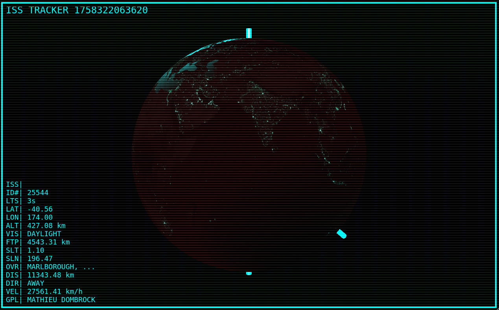

# ISS Tracker

A 3D real-time visualization of the International Space Station (ISS) location, built with [Babylon.js](https://www.babylonjs.com/). This project displays the ISS's current position and other telemetry on a interactive 3D globe. It can be used to determine when the ISS will pass over your real world location.



## >>> [CHECK IT OUT ON ITCH.IO](https://replicat.itch.io/iss-tracker)

## Features

- Real-time ISS position and telemetry (location, altitude, velocity, etc.)
- 3D Earth visualization with night textures and bump/specular mapping
- User location marker (via Geolocation API or city name)
- Automatic user positioning using the browser geolocation API
- ISS orbit path rendering (coming soon, [this is complicated](https://eol.jsc.nasa.gov/Tools/orbitTutorial.htm))
- Dynamic UI overlay with live data
- Camera controls and smooth focus on ISS
- Custom shaders for visual effects
- Debug mode for verbose logging

## Tech Stack
- TypeScript
- BabylonJS

## Getting Started

### Prerequisites

- Node.js and npm
- A static file server (e.g., `serve`, `http-server`, or similar)

### Installation

1. Clone the repository:

   ```sh
   git clone https://github.com/matdombrock/iss_tracker.git
   cd iss_tracker
   ```

2. Install dependencies:

   ```sh
   npm install
   ```

3. Build or start your development server as appropriate for your setup.

### Building

```sh
npx webpack
```

### Usage

1. Start a local server to serve the files in the project root:

   ```sh
   npx serve public
   # or
   npx http-server public
   ```

2. Open your browser and navigate to `http://localhost:3000` (or the port your server uses).

3. The app will attempt to use your geolocation. You can override this by adding a `city` parameter to the URL:

   ```
   http://localhost:3000/?city=Paris
   ```

4. Enable debug logging by adding `?dbg=1` to the URL.

### Controls

- **Mouse**: Rotate, zoom, and pan the globe.
- **Spacebar**: Focus and rotate the camera to the ISS position.

## Project Structure

- `src/index.ts` — Main application logic
- `img/` — Earth textures and bump/specular maps

## License

GPL — Mathieu Dombrock

## Credits

- [Babylon.js](https://www.babylonjs.com/)
- [OpenStreetMap Nominatim API](https://nominatim.openstreetmap.org/)
- [Where the ISS at? API](https://wheretheiss.at/)
- [SolarSystemScope](https://www.solarsystemscope.com) (image source)
